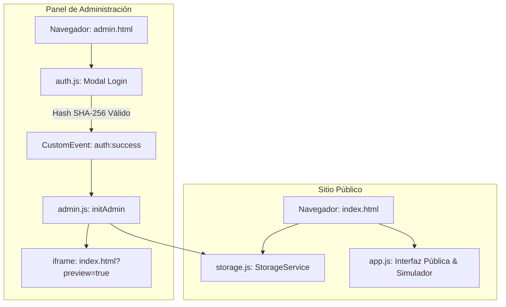

# ARCHITECTURE.md — Arquitectura del Sistema Horus Dron

## 1. Visión General
**Horus Dron** (Horus Academia) es una plataforma web para la capacitación de pilotos de aeronaves no tripuladas en la Categoría Abierta según la normativa ANAC (Resolución 550/2025). La solución está compuesta por:
* **Sitio Web Público (`index.html`):** Portal comercial e informativo con catálogo de cursos, simulador de examen ANAC interactivo y formulario de contacto.
* **Panel de Control Maestro (`admin.html`):** Interfaz dividida en pantalla (*split-screen*) para la administración de contenidos con vista previa en tiempo real (*live-preview iframe*).

---

## 2. Filosofía Single-Player
El sistema opera bajo la filosofía **Single-Player**:
* **Ejecución 100% en Cliente:** La aplicación se ejecuta de forma completamente autónoma en el navegador del usuario sin requerir un servidor backend o base de datos remota activa.
* **Persistencia Local:** Los datos del sitio se almacenan y leen directamente desde el almacenamiento local del navegador (`localStorage`) mediante el módulo `StorageService`.
* **Autenticación Desacoplada en Cliente:** La validación de credenciales se realiza de forma local utilizando la API criptográfica nativa del navegador (`crypto.subtle.digest` con SHA-256).

---

## 3. Principios Arquitectónicos Adoptados
1. **Regla de Interpretación Cero:** El código y la arquitectura responden estrictamente a requerimientos explícitos, eliminando suposiciones no autorizadas.
2. **Regla de No Regresión:** Cada modificación estructural debe garantizar que la funcionalidad preexistente y la experiencia visual continúen operando sin fallas.
3. **Principio de Evolución Controlada:** Las grandes refactorizaciones se fragmentan en subfases secuenciales aisladas para validar estabilidad antes de eliminar código heredado.
4. **Principio de Decisión Basada en Valor:** Se priorizan soluciones livianas, estables y nativas (Vanilla JS) sin agregar librerías, empaquetadores (*bundlers*) o dependencias externas innecesarias.
5. **Comunicación Event-Driven:** Desacoplamiento entre componentes mediante eventos nativos del navegador (`CustomEvent`).

---

## 4. Módulos Existentes y Responsabilidades

### 4.1 `storage.js` (`StorageService`)
* **Responsabilidad:** Capa de abstracción de entrada/salida (I/O) para la persistencia de datos.
* **Funciones:** `getData(key, defaultValue)`, `saveData(key, payload)`, `removeData(key)`. Encapsula el manejo de errores mediante bloques `try/catch`.

### 4.2 `app.js`
* **Responsabilidad:** Control de la interfaz del sitio público (`index.html`).
* **Funciones:** Manejo del menú desplegable móvil, efectos 3D tilt en tarjetas, desplazamiento suave (*smooth scroll*), animaciones de cabecera y fondo dinámico de drones, simulador del examen ANAC y lectura de datos guardados.

### 4.3 `auth.js` (`AuthService`)
* **Responsabilidad:** Módulo de autenticación independiente y autocontenido (IIFE).
* **Funciones:** Intercepción del formulario de acceso `#admin-login-form`, hash criptográfico SHA-256 de la contraseña, control de mensajes de error de login, ocultamiento del modal `#admin-login-modal`, mantenimiento del estado privado `_isAuthenticated` y emisión del evento `auth:success`.

### 4.4 `admin.js`
* **Responsabilidad:** Lógica del Panel de Control Maestro (`admin.html`).
* **Funciones:** Gestión de la navegación por pestañas del panel, formularios de edición (Portada, Cursos, Preguntas, Testimonios, Contacto), sincronización hacia el iframe de vista previa (`postMessage`), y operaciones de I/O (guardado, exportación/importación JSON y reseteo a valores de fábrica).

---

## 5. Flujo General del Sistema



---

## 6. Orden de Carga de Scripts (`admin.html`)

La inclusión de scripts en `admin.html` sigue un orden estricto de dependencias síncronas:

```html
<script src="storage.js?v=5"></script>
<script src="app.js?v=4"></script>
<script src="auth.js?v=1"></script>
<script src="admin.js?v=4"></script>
```

1. `storage.js`: Provee el servicio `StorageService` requerido por los módulos posteriores.
2. `app.js`: Carga librerías visuales y utilidades generales del cliente.
3. `auth.js`: Inicializa la escucha del modal de autenticación.
4. `admin.js`: Se suscribe al evento `auth:success` emitido por `auth.js` para arrancar el panel.

---

## 7. Comunicación Entre Módulos

* **Desacoplamiento Auth-Admin (`CustomEvent`):**
  `auth.js` emite el evento nativo en `document`:
  ```javascript
  document.dispatchEvent(new CustomEvent('auth:success', { detail: { timestamp: Date.now() } }));
  ```
  `admin.js` escucha el evento para mostrar el layout e inicializar los editores:
  ```javascript
  document.addEventListener('auth:success', () => {
      document.getElementById('admin-wrapper').style.display = 'flex';
      initAdmin();
  });
  ```
* **Sincronización Panel - Vista Previa (`postMessage`):**
  `admin.js` transmite mensajes postMessage al `iframe` de vista previa para sincronizar el scroll y actualización de datos en vivo.

---

## 8. Reglas de Dependencia y Módulos Prohibidos de Acoplar

* **`auth.js` NO debe depender de `admin.js`:** `auth.js` no invoca directamente funciones como `initAdmin()`.
* **`admin.js` NO debe manipular la autenticación:** `admin.js` no debe leer contraseñas, comparar hashes ni manipular `#admin-login-modal`.
* **`app.js` es independiente de `admin.js`:** La web pública opera sin conocimiento del panel administrativo.

---

## 9. Posibles Evoluciones Futuras

La arquitectura desacoplada basada en eventos y `StorageService` está diseñada para permitir una integración futura con servicios backend o bases de datos como **Supabase** o **Firebase**, reemplazando únicamente la capa `StorageService` y `auth.js` sin necesidad de reescribir la interfaz ni la lógica de componentes.
